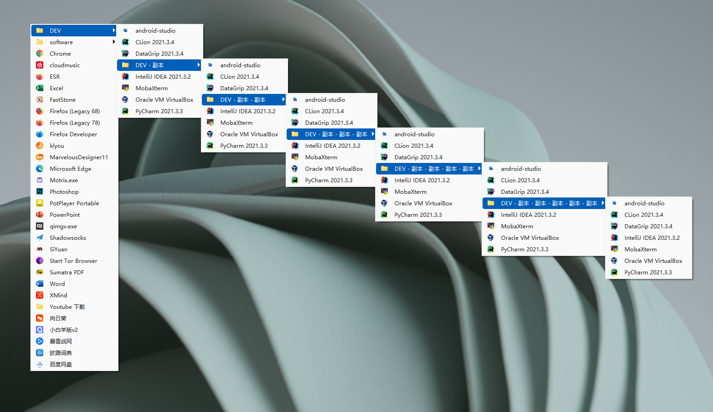

# # Seed Launcher
With seed starter, start seed, seed grow into towering tree
# Instructions
-  Install dependencies
```
pip install -r requirements.txt
```
- Put the shortcut into the lnk folder under the project, you can also create a folder in the lnk folder, and the folder supports nesting
- In the lnk folder, the shortcuts in the quick folder will be displayed on the first level of the menu
- Keyboard shortcut
    - alt+z show menu
    - esc hide menu
- startup you can create a shortcut for the launch.bat, put the shortcut into C:\ProgramData\Microsoft\Windows\Start Menu\Programs\Startup

# Example
